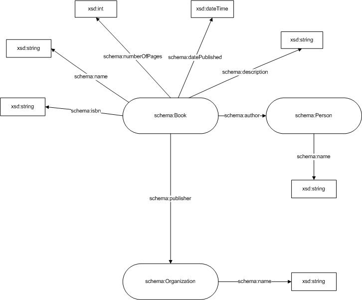
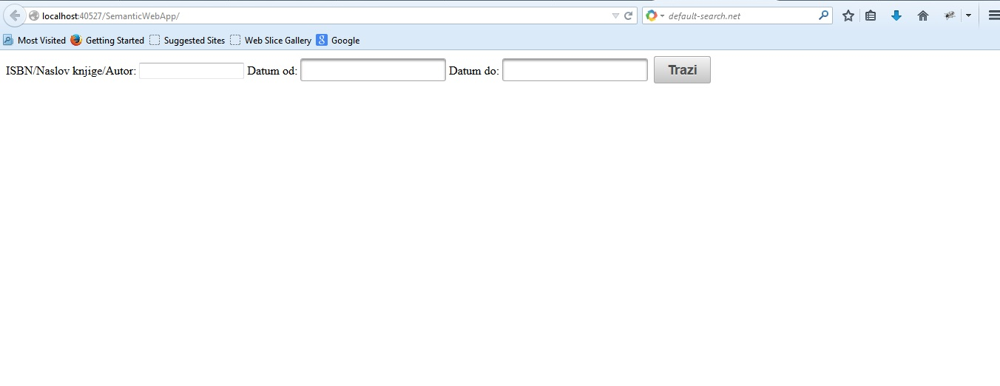
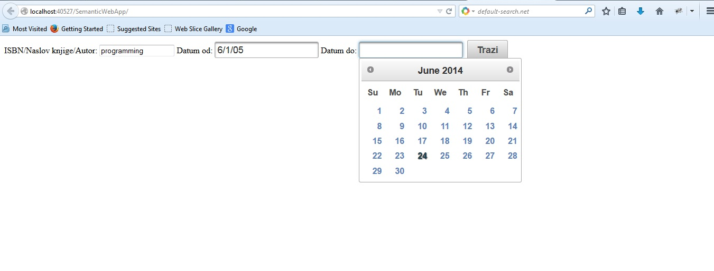
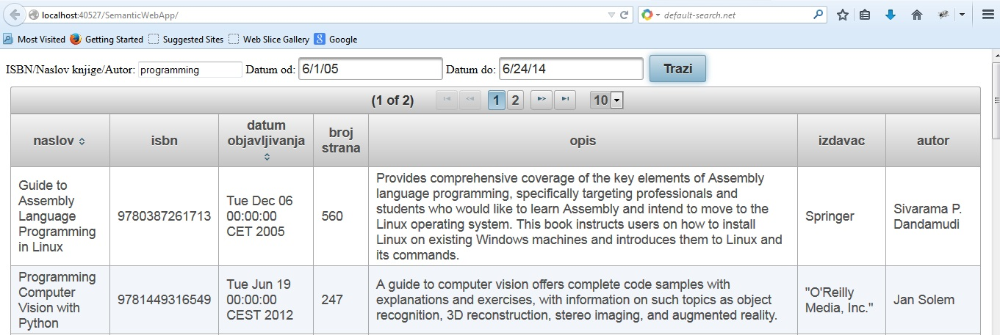

semanticwebapp
==============
#1. O projektu
Tema ovog projekta je kreiranje web aplikacije koja će omogućiti integraciju i pretragu podataka o knjigama. Naime, potrebno je preuzeti podatke o knjigama sa različitih izvora na webu i izvršiti njihovu integraciju u lokalni repozitorijum. Nakon preuzimanja podataka, potrebno ih je predstaviti korišćenjem odgovarajućeg RDF vokabulara (npr. [schema:Book](http://schema.org/Book)). Podatke treba smestiti u lokalni RDF repozitorijum (npr. [Jena TDB](http://jena.apache.org/documentation/tdb/)). Takođe, potrebno je implementirati jednostavan interfejs za pretragu ovih podataka korišćenjem SPARQL upita koji će se izvršavati nad lokalnim RDF repozitorijumom.

Osnovne faze u razvoju aplikacije:
* preuzimanje podataka sa različitih izvora na webu
* parsiranje podataka i njihova integracija
* predstavljanje podataka korišćenjem odgovarajućeg RDF vokabulara
* čuvanje podataka u lokalni RDF repozitorijum
* implementacija interfejsa za pretragu podataka

#2. Domenski model
Nakon analize podataka koje pružaju odabrani izvori podataka ([Bokshare](http://developer.bookshare.org/), [ISBNdb](http://isbndb.com/), [Google books](https://developers.google.com/books/?csw=1)), kao i podataka koje podržava odabrani RDF vokabular ([schema:Book](http://schema.org/Book)) kreiran je domenski model i prikazan je na slici ispod (Slika 1).




Slika 1 - Domenski model


Klasa Book sadrži osnovne podatke o knjizi kao što su: isbn, naslov knjige, broj strana, datum objavljivanja, kratak opis knjige kao i podatke o autorima preko reference na klasu Person i izdavaču knjige preko reference na klasu Organization.

Klasa Person sadrži informaciju o imenu osobe.

Klasa Organization sadrži informaciju o imenu organizacije.

#3. Rešenje
Aplikacija preuzima podatke iz tri različita izvora sa web-a ([Bokshare](http://developer.bookshare.org/), [ISBNdb](http://isbndb.com/), [Google books](https://developers.google.com/books/?csw=1)), zatim integriše te podatke i smešta ih u RDF repozitorijum. 

[Bokshare](http://developer.bookshare.org/) pruža podatke o knjigama u XML formatu. U nastavku je dat primer poziva web servisa: 
> [https://api.bookshare.org/book/search/category/Computers%20and%20Internet/page/1?api_key=mtdgrvurm6vhszb7xxtxc768](https://api.bookshare.org/book/search/category/Computers%20and%20Internet/page/1?api_key=mtdgrvurm6vhszb7xxtxc768) 

Parametar category govori o tome da se pretraga knjiga obavlja po kategoriji a za potrebe aplikacije pretraga knjiga se obavlja po kategoriji Computers and Internet. Broj rezultata koji se može dobiti po strani je 100 pa je potrebno izvršiti više poziva api-a u zavisnosti od broja rezultata koji se želi dobiti. Za potrebe aplikacije odlučeno je da se preuzmu svi podaci vezani za konkretnu kategoriju. Preuzeti su sledeći podaci o knjigama: naslov, opis knjige, isbn, autori i izdavač.

[ISBNdb](http://isbndb.com/) api pruža podatke u XML formatu. Primer poziva api-a:
> [http://isbndb.com/api/books.xml?access_key=M94ZHX5G&results=texts&index1=subject_id&value1=computers&page_number=1](http://isbndb.com/api/books.xml?access_key=M94ZHX5G&results=texts&index1=subject_id&value1=computers&page_number=1)

Parametar index1 predstavlja parametar po kome se vrši pretraga, u konkretnom slučaju u pitanju je subject_id odnosno kategorija. Value1 govori o tome po kojoj kategoriji se vrši pretraga. Za potrebe aplikacije pretraga se vrši po kategoriji Computers. [ISBNdb](http://isbndb.com/) api vraća samo 10 rezultata po strani pa je potrebno izvršiti više poziva kako bi se preuzeo željeni broj rezultata. Preuzeti su sledeći podaci o knjigama: naslov, isbn, autor i izdavač. 

[Google books](https://developers.google.com/books/?csw=1) api pruža podatke o knjigama u JSON formatu. Primer poziva ovog api-a: 
> [https://www.googleapis.com/books/v1/volumes?q=+subject:computers&maxResults=40&key=%20AIzaSyCfhdVI8zPi7BAL_UdlAb406nYnN6-hSks&startIndex=1](https://www.googleapis.com/books/v1/volumes?q=+subject:computers&maxResults=40&key=%20AIzaSyCfhdVI8zPi7BAL_UdlAb406nYnN6-hSks&startIndex=1) 

Parametar q se odnosi na kriterijum pretrage, koji je i u ovom slučaju kategorija knjige i to Computers kategorija. Maksimalan broj rezultata koji [Google books](https://developers.google.com/books/?csw=1) može da vrati po strani je 40. Sa [Google books](https://developers.google.com/books/?csw=1) api-a su preuzeti sledeći podaci o knjigama: naslov, opis, isbn, broj strana, autori, datum objavljivanja i izdavač. 

Kao što se može primetiti [Google books](https://developers.google.com/books/?csw=1) api pruža sve podatke koji su potrebni za aplikaciju, ali za određeni broj knjiga pojedini podaci ipak fale. Nakon preuzimanja podataka sa sva tri izvora, najpre se podaci koji fale za knjige preuzete sa [Google books](https://developers.google.com/books/?csw=1) api-a traže među podacima o knjigama preuzetih sa ostalih izvora. Nakon toga, integrišu se podaci preuzeti sa [Bokshare](http://developer.bookshare.org/) api-a i [ISBNdb](http://isbndb.com/) api-a da bi se po završetku integracije podaci smestili u RDF repozitorijum.

Takođe, aplikacija korisniku obezbeđuje interfejs za pretragu knjiga po različitim kriterijumima.

1. Korisnik najpre ulazi na stranicu aplikacije.

2. Korisnik unosi vrednosti po kojima pretražuje knjige (pretraga se može vršiti po isbn-u knjige, imenu autora, naslovu knjige, kao i vremenskom okviru u kome je knjiga izdata)

3. Rezultati pretrage se prikazuju korisniku u vidu tabele sa mogućnošću sortiranja rezultata po naslovu knjige i datumu.




#4. Implementacija
Aplikacija je napisana u programskom jeziku Java. 

Prilikom realizacije web aplikacije korišćene su sledeće Java tehnologije:

1. [Java Server Faces (JSF)](https://javaserverfaces.java.net/) sa [Primefaces](http://www.primefaces.org/) bibliotekom - za realizaciju korisničkog interfejsa.
[Java Server Faces (JSF)](https://javaserverfaces.java.net/) je okvir korišćen na serverskoj strani (server-side component framework) za izradu korisničkog interfejsa (user interface - UI) u web aplikacijama koje se
zasnivaju na Java tehnologiji. Jedna od najvećih prednosti JSF okvira je ta što nudi jasnu odvojenost između prezentacije i ponašanja sistema.

2. [Enterprise JavaBeans (EJB)](http://www.oracle.com/technetwork/java/javaee/ejb/index.html) - za realizaciju poslovne logike aplikacije.
[Enterprise JavaBeans (EJB)](http://www.oracle.com/technetwork/java/javaee/ejb/index.html) su JavaEE server-side komponente koje se izvršavaju unutar EJB kontejnerai učauruju poslovnu logiku JavaEE aplikacija. Ove komponente su skalabilne, transakcione,višenitne i mogu im pristupiti više korisnika u isto vreme. Enterprise bean-ovi pojednostavljuju razvoj distribuiranih aplikacija iz sledecih razloga:
	* EJB kontejner obezbeđuje sistemske servise (npr.upravljanje transakcijama) enterprise
	bean-ovima, dok se programer bean-a moze koncentrisati na rešavanje poslovnih
	problema.
	* Bean-ovi, a ne klijenti, sadrže poslovnu logiku aplikacije, dok se programer klijenta može
	fokusirati na predstavljanje klijenta. Programer klijenta ne mora da piše kod rutina
	koje implementiraju poslovna pravila ili pristup bazama podataka.
	* Enterprise bean-ovi su prenosive komponente. Ove aplikacije se mogu izvršavati na
	bilo kojem kompatibilnom Java EE serveru.

Za parsiranje preuzetih podataka u JSON formatu korišćena je [JSON.simple](https://code.google.com/p/json-simple/) biblioteka koja omogućava veoma jednostavno parsiranje. Kao što se može videti u primeru ispod, potrebno je metodi parse JSONParser objekta proslediti JSON tekst kako bi se izvršilo parsiranje nakon čega se veoma jednostavno izvlače željeni podaci pomoću objekata JSONArray (ako je u pitanju niz) i JSONObject (ako je reč o JSON objektu).

```
    JSONParser parser = new JSONParser();
    Object obj = parser.parse(tekst);
    JSONObject jsonObject = (JSONObject) obj;
    JSONArray niz=(JSONArray) jsonObject.get("items");
```

Za parsiranje preuzetih podataka u XML formatu korišćena je [dom4j](http://dom4j.sourceforge.net/) biblioteka. [Dom4j](http://dom4j.sourceforge.net/) je open source XML okvir (framework) za programski jezik Java koji omogućava čitanje, pisanje, navigaciju, kreiranje i modifikaciju XML dokumenata. U primeru ispod se može videti kako se XML dokument može parsirati, a zatim i kako se može vršiti navigacija kroz čvorove dokumenta i čitanje podataka.

```
    Document document=DocumentHelper.parseText(tekst);
    List list=document.selectNodes("//result");
    Node node=(Node) list.get(0);
    Node isbn=node.selectSingleNode("isbn13");
    System.out.println(isbn.getText());
```

Aplikacija koristi i [Jenabean](https://code.google.com/p/jenabean/) biblioteku, koja služi za mapiranje Java objekata u RDF triplete. Ovo mapiranje se vrši korišćenjem anotacija. [Jenabean](https://code.google.com/p/jenabean/) omogućava:
* predstavljanje Java objekata preko RDF tripleta
* vezuje atribute objekata za RDF propertije
* čuva relacije ka drugim objektima
* omogućava ponovno učitavanje objekata.

Ispod je dat primer mapiranja korišćenjem anotacija:

```
    @Namespace(Constants.SCHEMA)
    @RdfType("Book")
    public class Book extends Thing{
    	    @RdfProperty(Constants.SCHEMA+"isbn")
    	    private String isbn;
	    @RdfProperty(Constants.SCHEMA+"name")
	    private String title;
	    @RdfProperty(Constants.SCHEMA+"numberOfPages")
	    private int numberOfPages;
	    @RdfProperty(Constants.SCHEMA+"author")
	    private List<Person> authors;
	    @RdfProperty(Constants.SCHEMA+"publisher")
	    private Organization publisher;
	    @RdfProperty(Constants.SCHEMA+"datePublished")
	    private Date datePublished;
	    @RdfProperty(Constants.SCHEMA+"description")
	    private String description;
	    ...
    }
```
        
Prilikom razvoja aplikacije korišćena je i [Jena TDB](http://jena.apache.org/documentation/tdb/) biblioteka. [Jena TDB](http://jena.apache.org/documentation/tdb/) je biblioteka koja se koristi za perzistenciju, odnosno čuvanje podataka u RDF repozitorijumu.

Kako bi se omogućila pretraga podataka korišćen je [SPARQL](http://www.w3.org/TR/sparql11-query/). [SPARQL](http://www.w3.org/TR/sparql11-query/) je RDF upitni jezik pomoću koga je moguće čitati i manipulisati podacima u RDF formatu. 

#5. Priznanja
Ova aplikacija je razvijena za potrebe seminarskog rada iz predmeta [Inteligentni sistemi](http://is.fon.rs/) na Fakultetu organizacionih nauka, Univerzitet u Beogradu, Srbija.


